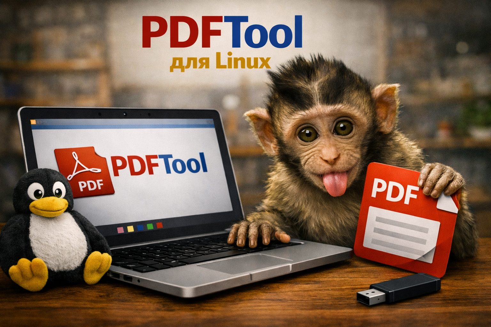

# 📄 PDF Tool — Універсальний редактор PDF

<div align="center">



**Потужний, безкоштовний та зручний застосунок для роботи з PDF-файлами**

[](https://github.com/VMelnikV/PDFTool/releases)
[](https://github.com/VMelnikV/PDFTool/blob/main/LICENSE)
[](https://www.python.org/)
[](https://appimage.org/)

</div>

---

## 📖 Про програму

**PDF Tool** — це потужний, безкоштовний та зручний застосунок для роботи з PDF-файлами, створений на Python з використанням PySide6. Програма об'єднує всі необхідні інструменти для щоденної роботи з PDF у єдиному інтерфейсі.

Програма працює як єдиний виконуваний файл (AppImage) і не потребує встановлення додаткових залежностей.

---

## 🚀 Основні можливості

### 🖼️ Конвертація зображень у PDF
- Підтримка форматів: PNG, JPG, JPEG, BMP, TIFF
- Конвертація одного або кількох зображень в єдиний PDF
- Автоматичне іменування на основі назви першого зображення
- Drag & Drop підтримка

### 📄 Об'єднання PDF
- Склеювання кількох PDF-файлів в один
- Можливість зміни порядку сторінок
- Автоматичне іменування результату

### ✂️ Розділення PDF
- Розділення на окремі сторінки
- Виділення діапазону сторінок
- Виділення однієї сторінки
- Збереження в окрему папку

### ✍️ Заповнення форм
- Автоматичне виявлення полів форми
- Підтримка текстових полів, чекбоксів та списків
- Збереження заповненої форми

### 📦 Стиснення PDF
- Три рівні стиснення: Екран (72 DPI), Електронна книга (150 DPI), Друк (300 DPI)
- Налаштування якості JPEG (1-100)
- Відображення відсотка зменшення розміру
- Використання Ghostscript для максимальної ефективності

---

## 🎯 Ключові особливості

- **Drag & Drop** — просто перетягніть файли у вікно програми
- **Автоматичне іменування** — програма сама пропонує назву файлу
- **Перевірка на існування** — при створенні файлу, який вже існує, програма запропонує перезаписати, змінити назву або скасувати
- **Прогрес-бар** — візуальний індикатор виконання операцій
- **Статусна стрічка** — інформація про поточний стан програми
- **Портативність** — працює як єдиний виконуваний файл (AppImage)

---

## 🛠️ Технології

| Компонент | Опис |
|-----------|------|
| **Python 3.12** | Мова програмування |
| **PySide6** | Графічний інтерфейс (Qt для Python) |
| **Pillow** | Робота із зображеннями |
| **pypdf** | Маніпуляції з PDF (об'єднання, розділення) |
| **PyPDFForm** | Заповнення PDF-форм |
| **Ghostscript** | Стиснення PDF |

---

## 💻 Системні вимоги

- **Linux** (Ubuntu 20.04 або новіший, або будь-який дистрибутив з підтримкою AppImage)
- **Мінімум 500 MB** вільного місця на диску
- **Мінімум 2 GB** оперативної пам'яті

---

## 📦 Встановлення та запуск

### AppImage (рекомендований спосіб)

```bash
# Завантажте PDFTool.AppImage
wget https://github.com/VMelnikV/PDFTool/releases/latest/download/PDFTool.AppImage

# Зробіть виконуваним
chmod +x PDFTool.AppImage

# Запустіть
./PDFTool.AppImage
```

Або просто двічі клацніть на файлі у файловому менеджері.

### З вихідного коду
```bash
# Клонуйте репозиторій
git clone https://github.com/VMelnikV/PDFTool.git
cd pdf-tool

# Встановіть залежності
pip install -r requirements.txt

# Запустіть програму
python3 cod/main.py
```
## 🙏 Подяки

DeepSeek — за те, що жодного разу не сказав "це неможливо" 😉

PySide6 — за потужний GUI-фреймворк

Ghostscript — за ефективне стиснення PDF

AppImage — за можливість створювати портативні застосунки

Pillow — за роботу із зображеннями

pypdf — за маніпуляції з PDF

PyPDFForm — за заповнення форм

<div align="center">

Зроблено з ❤️ для спільноти

</div>


<div align="center">

## Якщо є бажання віддячити та підтримати мене


https://send.monobank.ua/5M8pMbQG3A


</div>

