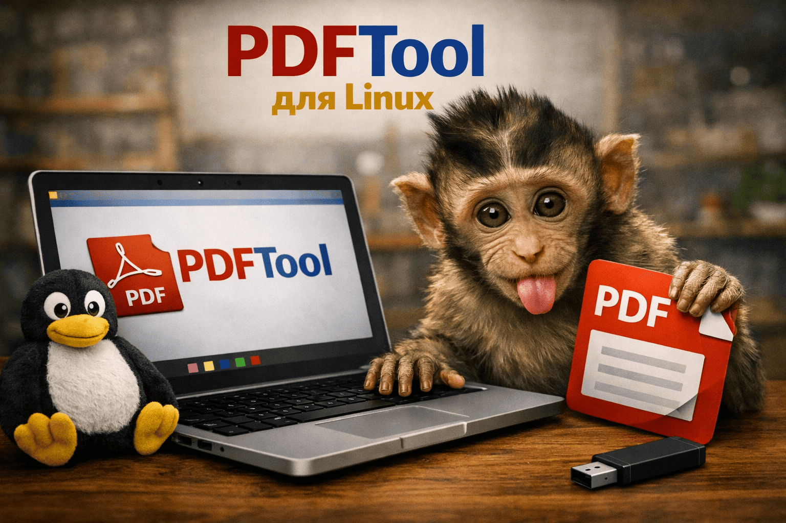

# 📄 PDF Tool — Універсальний редактор PDF

<div align="center">



**Потужний, безкоштовний та зручний застосунок для роботи з PDF-файлами**

[](https://gitlab.com/MelnikV/pdf_tool/-/releases)
[](LICENSE)
[](https://www.python.org/)
[](https://www.kernel.org/)
[](https://uk.crowdin.com/project/pdf-tool-for-linux)

</div>

---

## 📖 Про програму

**PDF Tool** — це потужний, безкоштовний та зручний застосунок для роботи з PDF-файлами, створений на Python з використанням PySide6. Програма об'єднує всі необхідні інструменти для щоденної роботи з PDF у єдиному інтерфейсі.

Проект доступний у двох версіях:
- **Light** — легка оболонка (~3 МБ) для тих, хто хоче налаштувати власний функціонал.
- **Full** — повна версія з усіма інструментами для роботи з PDF.

---

## 📸 Скріншоти

<div align="center">
  
  
</div>
<div align="center">
  
  
</div>
<div align="center">
  
</div>

---

## 🚀 Основні можливості

### 🖼️ Конвертація зображень у PDF
- Підтримка форматів: PNG, JPG, JPEG, BMP, TIFF
- Конвертація одного або кількох зображень в єдиний PDF
- Автоматичне іменування на основі назви першого зображення
- Drag & Drop підтримка

### 📄 Об'єднання PDF
- Склеювання кількох PDF-файлів в один
- Можливість зміни порядку сторінок
- Автоматичне іменування результату

### ✂️ Розділення PDF
- Розділення на окремі сторінки
- Виділення діапазону сторінок
- Виділення однієї сторінки
- Збереження в окрему папку

### ✍️ Заповнення форм
- Автоматичне виявлення полів форми
- Підтримка текстових полів, чекбоксів та списків
- Збереження заповненої форми

### 📦 Стиснення PDF
- Три рівні стиснення: Екран (72 DPI), Електронна книга (150 DPI), Друк (300 DPI)
- Налаштування якості JPEG (1-100)
- Відображення відсотка зменшення розміру
- Використання Ghostscript для максимальної ефективності

---

## 🎯 Ключові особливості

- **Drag & Drop** — просто перетягніть файли у вікно програми
- **Автоматичне іменування** — програма сама пропонує назву файлу
- **Перевірка на існування** — при створенні файлу, який вже існує, програма запропонує перезаписати, змінити назву або скасувати
- **Прогрес-бар** — візуальний індикатор виконання операцій
- **Статусна стрічка** — інформація про поточний стан програми
- **Портативність** — працює як єдиний виконуваний файл (AppImage)

---

## 🛠️ Технології

| Компонент | Опис |
|-----------|------|
| **Python 3.8+** | Мова програмування |
| **PySide6** | Графічний інтерфейс (Qt для Python) |
| **Pillow** | Робота із зображеннями |
| **pypdf** | Маніпуляції з PDF (об'єднання, розділення) |
| **PyPDFForm** | Заповнення PDF-форм |
| **Ghostscript** | Стиснення PDF |

---

## 💻 Системні вимоги

- **Linux** (Ubuntu 20.04 або новіший, або будь-який дистрибутив з підтримкою AppImage)
- **Мінімум 500 MB** вільного місця на диску
- **Мінімум 2 GB** оперативної пам'яті

---

## 📦 Встановлення та запуск

### 🐧 Встановлення через APT-репозиторій (рекомендований спосіб)

Додайте наш репозиторій та встановіть пакет:

```bash
# Додайте GPG-ключ та репозиторій
wget -qO - https://gitlab.com/MelnikV/pdf_tool/-/raw/main/packaging/apt/KEY.gpg | sudo apt-key add -
echo "deb https://gitlab.com/MelnikV/pdf_tool/-/raw/main/packaging/apt stable main" | sudo tee /etc/apt/sources.list.d/pdf-tool.list

# Оновіть список пакетів та встановіть повну версію
sudo apt update
sudo apt install pdf-tool-full

# Або для легкої версії:
# sudo apt install pdf-tool-light
```

Після встановлення програма з'явиться в меню застосунків або її можна запустити командою:

```bash
pdf-tool
```

### 📦 Встановлення з DEB-пакету

Завантажте та встановіть DEB-пакет вручну:

```bash
# Завантажте останню версію зі сторінки Releases
wget https://gitlab.com/MelnikV/pdf_tool/-/releases/download/v1.0.0/pdf-tool-full_1.0.0-1_all.deb

# Встановіть пакет
sudo dpkg -i pdf-tool-full_*.deb

# Якщо виникнуть проблеми з залежностями, виправте їх
sudo apt-get install -f
```

### 🪶 AppImage (портативна версія)

Light версія (~3 МБ):

```bash
wget https://gitlab.com/MelnikV/pdf_tool/-/releases/download/v1.0.0/PDFTool-Light.AppImage
chmod +x PDFTool-Light.AppImage
./PDFTool-Light.AppImage
```

Full версія (~93 МБ, все включено):

```bash
wget https://gitlab.com/MelnikV/pdf_tool/-/releases/download/v1.0.0/PDFTool-Full.AppImage
chmod +x PDFTool-Full.AppImage
./PDFTool-Full.AppImage
```

### 🐍 Запуск з вихідного коду

```bash
# Клонуйте репозиторій
git clone https://gitlab.com/MelnikV/pdf_tool.git
cd pdf_tool

# Встановіть залежності
pip install -r requirements/full.txt   # або requirements/light.txt

# Запустіть програму
python3 src/full/main.py               # або src/light/main.py
```

## 🌍 Допомога з перекладом

PDF Tool підтримує багатомовність. Якщо ви хочете допомогти з перекладом програми на вашу мову:

### Через Crowdin (рекомендовано)
1. Перейдіть на сторінку проєкту в [Crowdin](https://uk.crowdin.com/project/pdf-tool-for-linux)
2. Зареєструйтеся (або увійдіть) та оберіть мову
3. Почніть перекладати рядки — це просто!

### Локально (через Git)
1. Файли перекладів знаходяться в `src/common/i18n/translations/`
2. Створіть новий `.ts` файл для вашої мови, наприклад `pdf_tool_pl.ts` для польської
3. Використовуйте **Qt Linguist** для перекладу
4. Створіть Merge Request у цей репозиторій

### Як перевірити переклад локально
1. Згенеруйте `.qm` файл з вашого `.ts` (наприклад, за допомогою `lrelease`)
2. Помістіть його в `src/common/i18n/locale/XX/LC_MESSAGES/`
3. Запустіть програму — вона автоматично визначить системну мову

## 🤝 Як допомогти проекту
1. **Повідомляйте про помилки** через [Issue Tracker](https://gitlab.com/MelnikV/pdf_tool/-/issues)
2. **Пропонуйте нові функції** через [Merge Requests](https://gitlab.com/MelnikV/pdf_tool/-/merge_requests)
3. Допомагайте з перекладом на [Crowdin](https://uk.crowdin.com/project/pdf-tool-for-linux)
4. Поширюйте програму серед друзів та колег

## 📄 Ліцензія

Цей проект має власну некомерційну ліцензію. Детальніше дивіться у файлі LICENSE.

## 🙏 Подяки

- **DeepSeek** — за те, що жодного разу не сказав "це неможливо" 😉
- **PySide6** — за потужний GUI-фреймворк
- **Ghostscript** — за ефективне стиснення PDF
- **AppImage** — за можливість створювати портативні застосунки
- **Pillow** — за роботу із зображеннями
- **pypdf** — за маніпуляції з PDF
- **PyPDFForm** — за заповнення форм
- **Copilot** — за допомогу з зображенням

<div align="center">

Зроблено з ❤️ для спільноти

### Якщо є бажання віддячити та підтримати мене

[](https://send.monobank.ua/5M8pMbQG3A)

[https://send.monobank.ua/5M8pMbQG3A](https://send.monobank.ua/5M8pMbQG3A)
</div> ```
