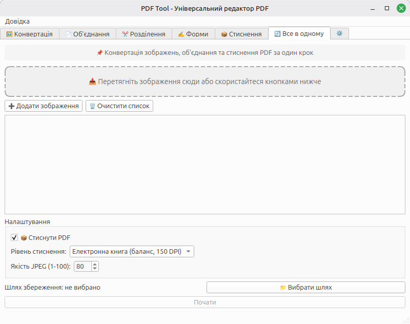
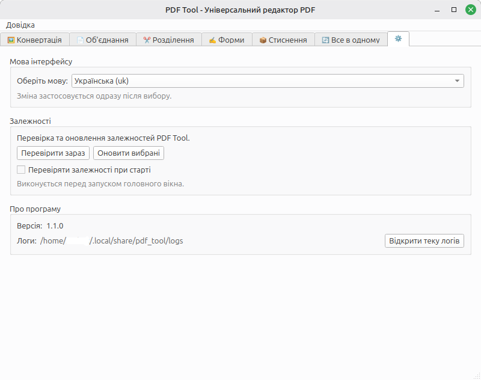
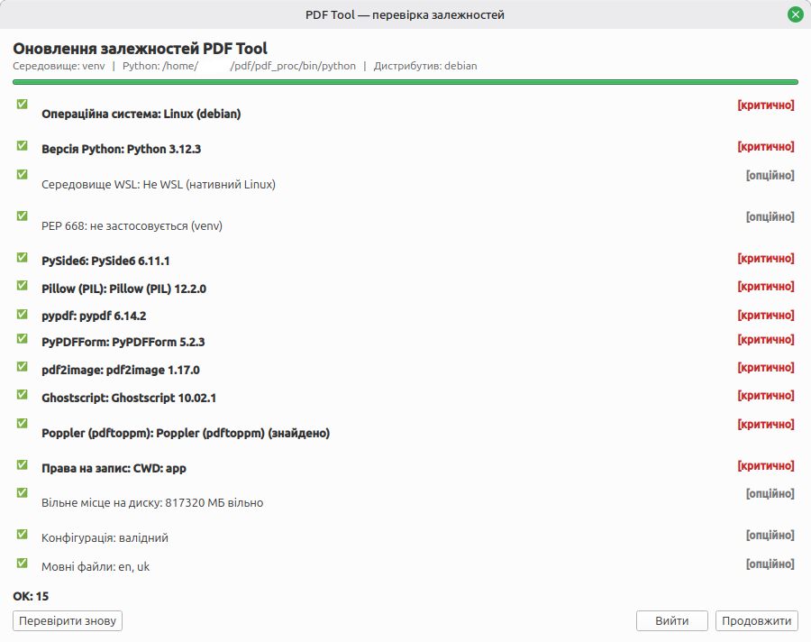

# 📄 PDF Tool — Універсальний редактор PDF

<div align="center">


[](https://github.com/VMelnikV/PDFTool/releases)
[](https://github.com/VMelnikV/PDFTool/blob/main/LICENSE)
[](https://www.python.org/)
[](https://www.kernel.org/)

</div>

## 📖 Про програму

**PDF Tool** — це потужний, безкоштовний та зручний застосунок для роботи з PDF-файлами, створений на Python з використанням PySide6. Програма об'єднує всі необхідні інструменти для щоденної роботи з PDF у єдиному інтерфейсі.

Програма працює як єдиний виконуваний файл (AppImage) і використовує **системний Ghostscript** для стиснення PDF.

---

## 📸 Скріншоти

### <div align="center">Конвертація зображень в PDF</div>
<div align="center">
  
</div>

### <div align="center">Об'єднання PDF файлів</div>
<div align="center">
  
</div>

### <div align="center">Розділення PDF файлів</div>
<div align="center">
  
</div>

### <div align="center">Робота з формами</div>
<div align="center">
  
</div>

### <div align="center">Стиснення PDF</div>
<div align="center">
  
</div>

### <div align="center">Все в одному</div>
<div align="center">
  
</div>

### <div align="center">Налаштування</div>
<div align="center">
  
</div>

### <div align="center">Перевірка залежностей</div>
<div align="center">
  
</div>

---

## 🚀 Основні можливості

### 🖼️ Конвертація зображень у PDF
- Підтримка форматів: PNG, JPG, JPEG, BMP, TIFF
- Конвертація одного або кількох зображень в єдиний PDF
- Автоматичне іменування на основі назви першого зображення
- Drag & Drop підтримка

### 📄 Об'єднання PDF
- Склеювання кількох PDF-файлів в один
- Можливість зміни порядку сторінок
- Автоматичне іменування результату

### ✂️ Розділення PDF
- Розділення на окремі сторінки
- Виділення діапазону сторінок
- Виділення однієї сторінки
- Збереження в окрему папку

### ✍️ Заповнення форм
- Автоматичне виявлення полів форми
- Підтримка текстових полів, чекбоксів та списків
- Збереження заповненої форми

### 📦 Стиснення PDF
- Три рівні стиснення: Екран (72 DPI), Електронна книга (150 DPI), Друк (300 DPI)
- Налаштування якості JPEG (1-100)
- Відображення відсотка зменшення розміру
- Використання системного Ghostscript

### 🔄 Все в одному
- Конвертація, об'єднання та стиснення за один крок

---

## 🔍 Перевірка залежностей

При першому запуску PDF Tool автоматично перевіряє всі залежності:
PySide6, Pillow, pypdf, PyPDFForm, pdf2image, Ghostscript, poppler-utils
та системні вимоги (Linux, права на запис, вільне місце).

**Що перевіряється:**
- 🐍 **Python-бібліотеки** — версія, наявність, сумісність
- 🔧 **Системні утиліти** — Ghostscript, poppler-utils
- 💻 **Середовище** — venv / conda / pipx / system
- 🐧 **ОС** — Linux, дистрибутив, WSL, PEP 668
- 📁 **Файлова система** — права на запис, вільне місце
- 🌐 **Локалізація** — наявність мовних файлів

**Що робить, якщо чогось немає:**
- Показує **готову інструкцію з встановлення** (з урахуванням venv / PEP 668 / дистрибутива)
- Пропонує **автовстановлення** через pip (без sudo)
- Кнопка **«Копіювати»** — завжди без sudo (безпечніше)

**Де керувати:**
- Вкладка **⚙️** (шестерінка) — чекбокс «Перевіряти при старті»
- Меню **Довідка → Перевірити залежності** (Ctrl+Shift+D)
- CLI: `python launcher.py --check-only`

### 🔄 Оновлення залежностей

Кнопка **«Оновити залежності»** у шестерінці:
- Перевіряє PyPI на нові версії
- Показує список: `Pillow 12.2.0 → 12.3.0`
- Дозволяє вибрати, що оновлювати (чекбокси)
- При помилці — показує **альтернативні варіанти**
- Після успіху — попереджає про перезапуск

### 💻 CLI-режим

Для скриптів і CI:

```bash
# Тільки перевірка, без запуску GUI
python launcher.py --check-only

# Вивід у JSON
python launcher.py --check-only --json

# Строгий режим (exit code != 0 при критичних)
python launcher.py --check-only --strict

# Примусово вибрати UI
python launcher.py --ui=cli

# Запустити, ігноруючи критичні помилки
python launcher.py --force

# Показати версію
python launcher.py --version
```

---

## 🎯 Ключові особливості

- **Drag & Drop** — просто перетягніть файли у вікно програми
- **Автоматичне іменування** — програма сама пропонує назву файлу
- **Перевірка на існування** — при створенні файлу, який вже існує, програма запропонує перезаписати, змінити назву або скасувати
- **Прогрес-бар** — візуальний індикатор виконання операцій
- **Статусна стрічка** — інформація про поточний стан програми
- **Багатомовність** — підтримка української та англійської мов
- **Портативність** — працює як єдиний виконуваний файл (AppImage)

---

## 🛠️ Технології

| Компонент | Опис |
|-----------|------|
| **Python 3.12** | Мова програмування |
| **PySide6** | Графічний інтерфейс (Qt для Python) |
| **Pillow** | Робота із зображеннями |
| **pypdf** | Маніпуляції з PDF (об'єднання, розділення) |
| **PyPDFForm** | Заповнення PDF-форм |
| **Ghostscript** | Стиснення PDF (системний) |

### Внутрішні модулі

| Модуль | Опис |
|--------|------|
| `common.deps` | Перевірка залежностей і оновлення |
| `common.deps.ui` | Вікна перевірки (PySide6 + CLI) |
| `common.version` | Єдине джерело версії |
| `common.i18n` | Локалізація (uk / en) |

---

## 💻 Системні вимоги

- **Linux** (Ubuntu 20.04 або новіший, або будь-який дистрибутив з підтримкою AppImage)
- **Ghostscript** (системний): `sudo apt install ghostscript`
- **Мінімум 100 MB** вільного місця на диску
- **Мінімум 2 GB** оперативної пам'яті

---

## 📦 Встановлення та запуск

### AppImage (рекомендований спосіб)

```bash
# Завантажте останню версію
wget https://github.com/VMelnikV/PDFTool/releases/latest/download/PDFTool-x86_64.AppImage

# Зробіть виконуваним
chmod +x PDFTool-x86_64.AppImage

# Встановіть Ghostscript (якщо ще не встановлено)
sudo apt install ghostscript

# Запустіть
./PDFTool-x86_64.AppImage
```
### DEB-пакет (альтернатива AppImage)

```bash
wget https://github.com/VMelnikV/PDFTool/releases/latest/download/pdf-tool_1.1.0-1_all.deb
sudo apt install ./pdf-tool_1.1.0-1_all.deb
```
*За потреби змініть версію на актуальну, яку можна дізнатись на [сторінці релізів](https://github.com/VMelnikV/PDFTool/releases)*

### З вихідного коду
```bash

# Клонуйте репозиторій
git clone https://github.com/VMelnikV/PDFTool.git
cd pdf_tool

# Встановіть залежності
pip install -r requirements/base.txt

# Встановіть Ghostscript
sudo apt install ghostscript

# Запустіть програму
python3 src/app/main.py
```

## 🌍 Додавання нової мови

Ви можете додати нову мову без перезбірки AppImage:
Крок 1: Створіть папку
```bash

mkdir -p ~/.config/pdf_tool/translations
```
Крок 2: Скопіюйте шаблон

Скопіюйте en.json з репозиторію як шаблон:
```bash

cp src/common/i18n/translations/en.json ~/.config/pdf_tool/translations/pl.json
```
Крок 3: Перекладіть

Відкрийте pl.json у текстовому редакторі та перекладіть усі значення.

Крок 4: Перезапустіть програму

```bash
./PDFTool-x86_64.AppImage
```

Програма автоматично підхопить новий переклад!

### 📋 Приклад структури

```
~/.config/pdf_tool/translations/
├── pl.json    ← ваш новий переклад
├── uk.json    ← перевизначає вбудований
└── en.json    ← перевизначає вбудований
```

## 📂 Структура проєкту

```
pdf_tool/
├── .github/
│   └── workflows/
│       ├── ci.yml                      # GitHub Actions: тести (unit + integration)
│       └── release.yml                 # GitHub Actions: збірка .deb + AppImage при тегу v*
├── docs/
│   └── screenshots/                    # Скріншоти для README (1.png … 5.png)
├── packaging/
│   ├── appimage/
│   │   └── app/
│   │       └── AppImageBuilder.yml     # Конфіг збірки AppImage
│   ├── debian/
│   │   └── app/
│   │       ├── control                 # Метадані Debian-пакета (залежності, опис)
│   │       ├── changelog               # Історія версій для deb
│   │       ├── copyright               # Ліцензія для deb
│   │       ├── rules                   # Правила збірки deb
│   │       ├── postinst                # Скрипт після встановлення
│   │       ├── prerm                   # Скрипт перед видаленням
│   │       └── pdf-tool.desktop        # Ярлик у меню застосунків
│   └── desktop/
│       ├── appimage/
│       │   └── com.melnikv.pdftool.desktop    # .desktop для AppImage
│       └── debian/
│           └── pdf-tool.desktop               # .desktop для deb
├── requirements/
│   └── base.txt                        # Python-залежності (PySide6, Pillow, pypdf, …)
├── scripts/
│   ├── build-appimage.sh               # Скрипт збірки AppImage
│   ├── build-deb.sh                    # Скрипт збірки .deb
│   └── update-translations.sh          # Оновлення перекладів з GitHub
├── src/
│   ├── __init__.py
│   ├── app/                            # Вихідний код застосунку
│   │   ├── __init__.py
│   │   ├── launcher.py                 # Точка входу: перевірка → GUI
│   │   │                               #   CLI: --check-only, --json, --strict,
│   │   │                               #        --ui, --force, --version, --help
│   │   ├── main.py                     # QApplication + показ PDFTool
│   │   ├── pdf_tool.py                 # Головне вікно (QTabWidget + меню)
│   │   ├── README.md                   # Внутрішня документація для розробників
│   │   ├── tabs/                       # Вкладки головного вікна
│   │   │   ├── __init__.py
│   │   │   ├── convert_tab.py          # 🖼️ Конвертація зображень у PDF
│   │   │   ├── merge_tab.py            # 📄 Об'єднання PDF
│   │   │   ├── split_tab.py            # ✂️ Розділення PDF
│   │   │   ├── forms_tab.py            # ✍️ Заповнення форм
│   │   │   ├── compress_tab.py         # 📦 Стиснення PDF (Ghostscript)
│   │   │   ├── all_in_one_tab.py       # 🔄 Все в одному (конвертація+об'єднання+стиснення)
│   │   │   └── settings_tab.py         # ⚙️ Шестерінка (мова, залежності, оновлення)
│   │   └── utils/
│   │       ├── __init__.py
│   │       └── pdf_utils.py            # Спільні утиліти (Drag&Drop, робота з файлами)
│   └── common/                         # Спільні модулі для app/ і тестів
│       ├── __init__.py
│       ├── version.py                  # Єдине джерело версії (__version__)
│       ├── deps/                       # Модуль перевірки залежностей
│       │   ├── __init__.py
│       │   ├── env.py                  # EnvInfo: venv/conda/pipx/system,
│       │   │                           #   дистрибутив Linux, WSL, PEP 668
│       │   ├── style.py                # Статуси (Status), іконки, кольори,
│       │   │                           #   бейджі «критично»/«опційно», ANSI
│       │   ├── instructions.py         # Генерація інструкцій встановлення
│       │   │                           #   (venv / conda / pipx / system / PEP 668)
│       │   ├── report.py               # CheckReport, run_all_checks
│       │   ├── updater.py              # Перевірка PyPI + pip install -U
│       │   ├── config.py               # ~/.config/pdf_tool/config.json
│       │   ├── checks/                 # Окремі перевірки
│       │   │   ├── __init__.py
│       │   │   ├── base.py             # Check, CheckResult (абстрактний контракт)
│       │   │   ├── registry.py         # CHECKS: список усіх перевірок
│       │   │   ├── platform_check.py   # Linux-only
│       │   │   ├── python_check.py     # Python ≥ 3.10
│       │   │   ├── pyside_check.py     # PySide6 ≥ 6.5
│       │   │   ├── lib_check.py        # Універсальний для Python-бібліотек
│       │   │   ├── external_check.py   # Універсальний для системних утиліт
│       │   │   ├── wsl_check.py        # Попередження для WSL
│       │   │   ├── pep668_check.py     # PEP 668 (externally-managed)
│       │   │   ├── fs_check.py         # Права на запис + вільне місце
│       │   │   ├── config_check.py     # Валідність config.json
│       │   │   └── locale_check.py     # Наявність мовних файлів
│       │   └── ui/                     # Вікна перевірки
│       │       ├── __init__.py
│       │       ├── base.py             # DependencyWindowBase, DialogResult
│       │       ├── launcher.py         # Вибір UI (qt → cli за каскадом)
│       │       ├── qt_window.py        # PySide6-вікно перевірки
│       │       ├── cli_report.py       # CLI-вивід (fallback)
│       │       └── update_dialog.py    # Діалог оновлення залежностей
│       ├── i18n/                       # Локалізація
│       │   ├── __init__.py
│       │   ├── translator.py           # Translator: tr(), trf(), set_language()
│       │   └── translations/
│       │       ├── en.json             # Англійська
│       │       ├── uk.json             # Українська
│       │       └── .gitkeep
│       └── resources/                  # Статичні ресурси
│           ├── icons/
│           │   ├── pdf_icon.png        # Іконка застосунку
│           │   ├── mono.png            # Іконка Monobank (для README)
│           │   └── .gitkeep
│           └── styles/
│               └── .gitkeep            # Майбутні QSS-стилі
├── tests/
│   ├── integration/
│   │   ├── test_gui.py                 # GUI-тести (offscreen Qt)
│   │   └── .gitkeep
│   └── unit/
│       ├── test_translator.py          # Тести перекладача
│       ├── test_deps_env.py            # Тести EnvInfo, PEP 668, дистрибутива
│       ├── test_deps_instructions.py   # Тести strip_sudo, інструкцій
│       ├── test_deps_report.py         # Тести CheckReport, run_all_checks
│       └── .gitkeep
├── .gitignore                          # Ігнорування .venv, __pycache__, build/, …
├── conftest.py                         # Налаштування pytest (sys.path)
├── LICENSE                             # Кастомна non-commercial ліцензія
├── pytest.ini                          # Конфіг pytest
└── README.md                           # Цей файл
```
## 🙏 Подяки

DeepSeek — за те, що жодного разу не сказав "це неможливо" 😉

PySide6 — за потужний GUI-фреймворк

Ghostscript — за ефективне стиснення PDF

AppImage — за можливість створювати портативні застосунки

Pillow — за роботу із зображеннями

pypdf — за маніпуляції з PDF

PyPDFForm — за заповнення форм

## 📄 Ліцензія

Детальніше у файлі [LICENSE](https://github.com/VMelnikV/PDFTool/blob/main/LICENSE).


## <div align="center">Зроблено з ❤️ для спільноти</div>


<div align="center">
### Якщо є бажання віддячити та підтримати мене


https://send.monobank.ua/5M8pMbQG3A
</div>

