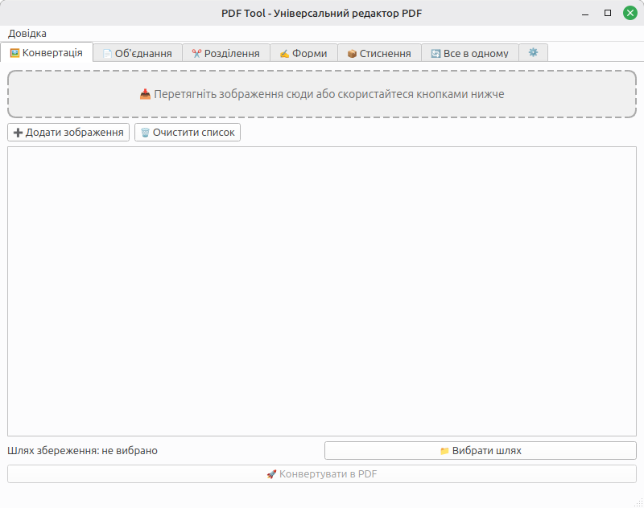
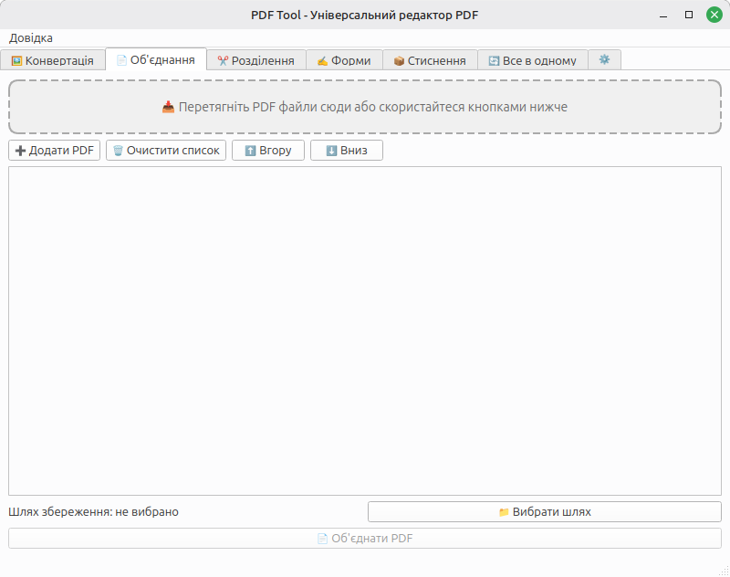
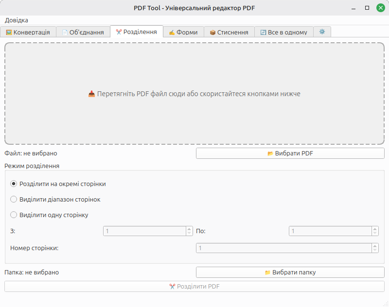
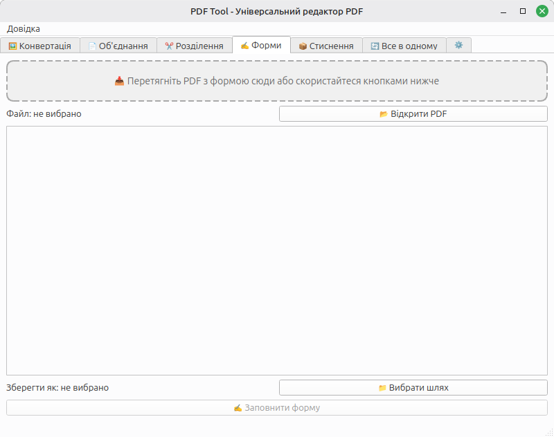
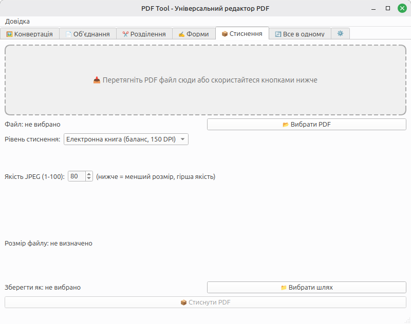

# 📄 PDF Tool — Універсальний редактор PDF

<div align="center">


[](https://github.com/VMelnikV/PDFTool/releases)
[](https://github.com/VMelnikV/PDFTool/blob/main/LICENSE)
[](https://www.python.org/)
[](https://www.kernel.org/)

</div>
---

## 📖 Про програму

**PDF Tool** — це потужний, безкоштовний та зручний застосунок для роботи з PDF-файлами, створений на Python з використанням PySide6. Програма об'єднує всі необхідні інструменти для щоденної роботи з PDF у єдиному інтерфейсі.

Програма працює як єдиний виконуваний файл (AppImage) і використовує **системний Ghostscript** для стиснення PDF.

---

## 📸 Скріншоти

### <div align="center">Конвертація зображень в PDF</div>
<div align="center">
  
</div>

### <div align="center">Об'єднання PDF файлів</div>
<div align="center">
  
</div>

### <div align="center">Розділення PDF файлів</div>
<div align="center">
  
</div>

### <div align="center">Робота з формами</div>
<div align="center">
  
</div>

### <div align="center">Стиснення PDF</div>
<div align="center">
  
</div>

---

## 🚀 Основні можливості

### 🖼️ Конвертація зображень у PDF
- Підтримка форматів: PNG, JPG, JPEG, BMP, TIFF
- Конвертація одного або кількох зображень в єдиний PDF
- Автоматичне іменування на основі назви першого зображення
- Drag & Drop підтримка

### 📄 Об'єднання PDF
- Склеювання кількох PDF-файлів в один
- Можливість зміни порядку сторінок
- Автоматичне іменування результату

### ✂️ Розділення PDF
- Розділення на окремі сторінки
- Виділення діапазону сторінок
- Виділення однієї сторінки
- Збереження в окрему папку

### ✍️ Заповнення форм
- Автоматичне виявлення полів форми
- Підтримка текстових полів, чекбоксів та списків
- Збереження заповненої форми

### 📦 Стиснення PDF
- Три рівні стиснення: Екран (72 DPI), Електронна книга (150 DPI), Друк (300 DPI)
- Налаштування якості JPEG (1-100)
- Відображення відсотка зменшення розміру
- Використання системного Ghostscript

### 🔄 Все в одному
- Конвертація, об'єднання та стиснення за один крок

---

## 🎯 Ключові особливості

- **Drag & Drop** — просто перетягніть файли у вікно програми
- **Автоматичне іменування** — програма сама пропонує назву файлу
- **Перевірка на існування** — при створенні файлу, який вже існує, програма запропонує перезаписати, змінити назву або скасувати
- **Прогрес-бар** — візуальний індикатор виконання операцій
- **Статусна стрічка** — інформація про поточний стан програми
- **Багатомовність** — підтримка української та англійської мов
- **Портативність** — працює як єдиний виконуваний файл (AppImage)

---

## 🛠️ Технології

| Компонент | Опис |
|-----------|------|
| **Python 3.12** | Мова програмування |
| **PySide6** | Графічний інтерфейс (Qt для Python) |
| **Pillow** | Робота із зображеннями |
| **pypdf** | Маніпуляції з PDF (об'єднання, розділення) |
| **PyPDFForm** | Заповнення PDF-форм |
| **Ghostscript** | Стиснення PDF (системний) |

---

## 💻 Системні вимоги

- **Linux** (Ubuntu 20.04 або новіший, або будь-який дистрибутив з підтримкою AppImage)
- **Ghostscript** (системний): `sudo apt install ghostscript`
- **Мінімум 100 MB** вільного місця на диску
- **Мінімум 2 GB** оперативної пам'яті

---

## 📦 Встановлення та запуск

### AppImage (рекомендований спосіб)

```bash
# Завантажте останню версію
wget https://github.com/VMelnikV/PDFTool/releases/latest/download/PDFTool-x86_64.AppImage

# Зробіть виконуваним
chmod +x PDFTool-x86_64.AppImage

# Встановіть Ghostscript (якщо ще не встановлено)
sudo apt install ghostscript

# Запустіть
./PDFTool-x86_64.AppImage
```
### DEB-пакет (альтернатива AppImage)

```bash
wget https://github.com/VMelnikV/PDFTool/releases/latest/download/pdf-tool_1.0.2-1_all.deb
sudo apt install ./pdf-tool_1.0.2-1_all.deb
```
*За потреби змініть версію на актуальну, яку можна дізнатись на [сторінці релізів](https://github.com/VMelnikV/PDFTool/releases)*

### З вихідного коду
```bash

# Клонуйте репозиторій
git clone https://github.com/VMelnikV/PDFTool.git
cd pdf_tool

# Встановіть залежності
pip install -r requirements/base.txt

# Встановіть Ghostscript
sudo apt install ghostscript

# Запустіть програму
python3 src/app/main.py
```

## 🌍 Додавання нової мови

Ви можете додати нову мову без перезбірки AppImage:
Крок 1: Створіть папку
bash

mkdir -p ~/.config/pdf_tool/translations

Крок 2: Скопіюйте шаблон

Скопіюйте en.json з репозиторію як шаблон:
bash

cp src/common/i18n/translations/en.json ~/.config/pdf_tool/translations/pl.json

Крок 3: Перекладіть

Відкрийте pl.json у текстовому редакторі та перекладіть усі значення.
Крок 4: Перезапустіть програму

```bash
./PDFTool-x86_64.AppImage
```

Програма автоматично підхопить новий переклад!

### 📋 Приклад структури

~/.config/pdf_tool/translations/
├── pl.json    ← ваш новий переклад
├── uk.json    ← перевизначає вбудований
└── en.json    ← перевизначає вбудований

## 📂 Структура проєкту

pdf_tool/
├── src/
│   ├── app/                    # Вихідний код
│   │   ├── main.py             # Точка входу
│   │   ├── launcher.py         # Перевірка залежностей
│   │   ├── pdf_tool.py         # Головне вікно
│   │   ├── tabs/               # Вкладки
│   │   └── utils/              # Утиліти
│   └── common/                 # Спільні ресурси
│       ├── i18n/               # Переклади
│       └── resources/          # Іконки, стилі
├── packaging/                  # Файли для пакування
│   ├── appimage/               # AppImage
│   ├── debian/                 # Debian
│   └── desktop/                # .desktop файли
├── scripts/                    # Скрипти збірки
├── requirements/               # Python-залежності
├── docs/                       # Документація
└── tests/                      # Тести

## 🙏 Подяки

DeepSeek — за те, що жодного разу не сказав "це неможливо" 😉

PySide6 — за потужний GUI-фреймворк

Ghostscript — за ефективне стиснення PDF

AppImage — за можливість створювати портативні застосунки

Pillow — за роботу із зображеннями

pypdf — за маніпуляції з PDF

PyPDFForm — за заповнення форм

<div align="center"> Зроблено з ❤️ для спільноти</div>

<div align="center">

## Якщо є бажання віддячити та підтримати мене


https://send.monobank.ua/5M8pMbQG3A


</div>

## 📄 Ліцензія

Детальніше у файлі [LICENSE](https://github.com/VMelnikV/PDFTool/blob/main/LICENSE).
